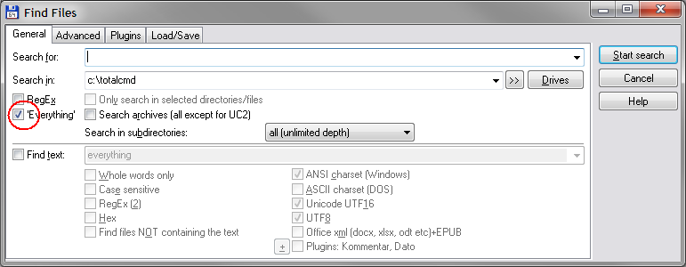
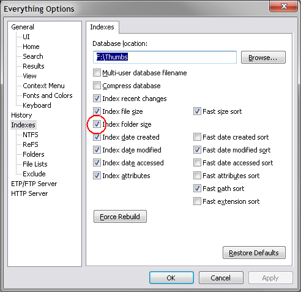
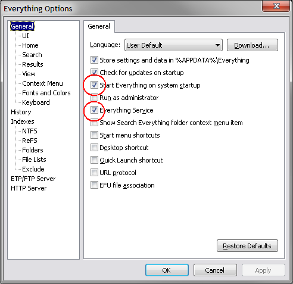

## everything

You can use ''Everything' in two ways with TC. For searching where you have to enable it by ticking the box: 'Everything' (TC 9.0 or later) in the "Find files" dialog. (http://madsenworld.dk/tcmd/everything1.png )

You can also use 'Everything' to give fast results for calculating dir-sizes when you press Alt+Shift+Enter (TC 9.10 or later). You must enable that in "Options" -> "Operation" -> "Calculate space occupied by subdirectories" -> "Everything".  (http://madsenworld.dk/tcmd/everything2.png )

For the latter to work, you have to configure 'Everything' to index folder sizes: "Everything Options" -> "Indexes" -> "Index folder size". ( http://madsenworld.dk/tcmd/everything3.png )

It is recommended that you use 'Everything' version 1.4 or newer.

Everything has to be running before TC starts. The easiest way is to install 'Everything' as a Service and start it at system startup. ( http://madsenworld.dk/tcmd/everything4.png )

